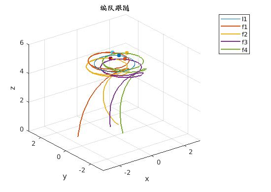
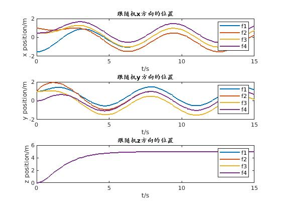
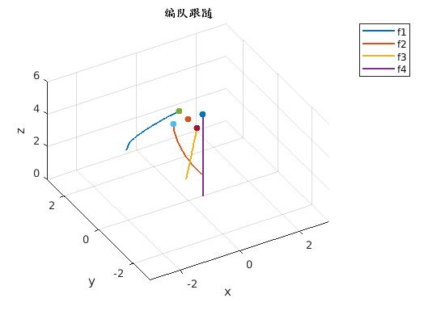
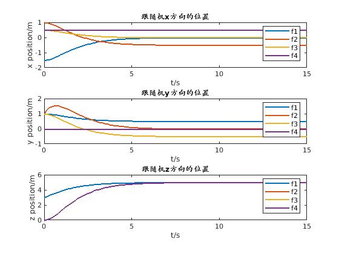
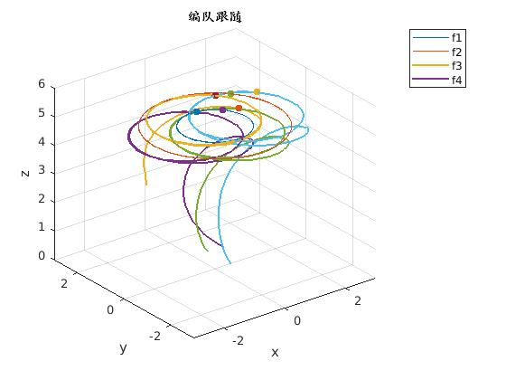
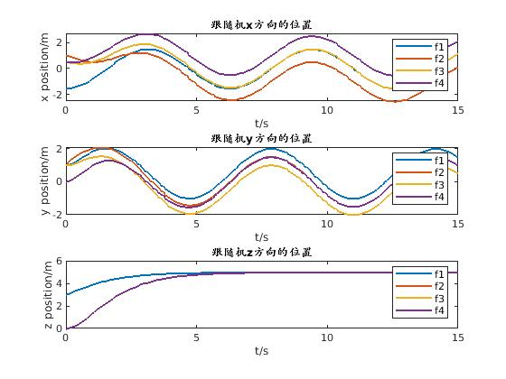
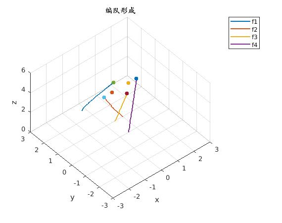
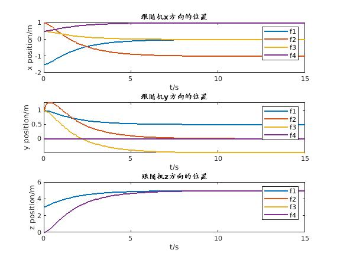

# SRTP-sim
[SRTP] quadrotor formation sim

## 变量

| 变量名 | 含义                              |
| ------ | --------------------------------- |
| $v_0$  | 四旋翼编队的速度                  |
| $V_i$  | 第$i$架四旋翼在机体坐标系中的速度 |
|        |                                   |
|        |                                   |
|        |                                   |
|        |                                   |
|        |                                   |
|        |                                   |
|        |                                   |

## 自适应的编队控制算法

### 领航机编队的控制

我们首先研究两架领航机的控制律，因为这两架领航机的运动不受跟随机的影响，我们可以独立地考虑领航机系统的控制。

- **Setp1**首先通过领航机1在导航坐标系下的速度来确定飞行编队的整体速度$v_0$，即$v_0 = {^E_B}RV_1$
- **Step2**     利用一致性算法控制领航机2的偏航角$\psi_2$和领航机1保持一致：

## 仿真部分

### One-Leader

#### 仿真参数

领航机的参数：
$$
领航机移动轨迹
\left\{
    \begin{array}{p}
        x^{l1} = -cost	\\
        y^{l1} = sint	\\
        z^{l1} = 5		\\
    \end{array}
\right.
$$

$$
领航机对应速度
\left\{
    \begin{array}{p}
        v_x^{l1} = sint	\\
        v_y^{l1} = cost	\\
        v_z^{l1} = 0		\\
    \end{array}
\right.
$$

跟随机的参数：

| 参数指标     | **跟随机1**    | **跟随机2**    | **跟随机3**    | **跟随机4**   |
| ------------ | -------------- | -------------- | -------------- | ------------- |
| **起始位置** | $[-1.5; 1; 0]$ | $[1; 1; 0]$    | $[0.5; 1; 0]$  | $[0.5; 0; 0]$ |
| **起始速度** | $ [0; 0; 0] $  | $ [0; 2; 0] $  | $ [0; 0; 0] $  | $ [0; 0; 0] $ |
| **期望距离** | $[0; 0.5; 0]$  | $[-0.5; 0; 0]$ | $[0; -0.5; 0]$ | $[0.5; 0; 0]$ |

#### 仿真结果

### One-Leader-Fixed

#### 仿真参数

领航机的参数：
$$
领航机移动轨迹
\left\{
    \begin{array}{p}
        x^{l1} = 0	\\
        y^{l1} = 0	\\
        z^{l1} = 5		\\
    \end{array}
\right.
$$

$$
领航机对应速度
\left\{
    \begin{array}{p}
        v_x^{l1} = 0	\\
        v_y^{l1} = 0	\\
        v_z^{l1} = 0		\\
    \end{array}
\right.
$$

跟随机的参数：

| 参数指标     | **跟随机1**    | **跟随机2**    | **跟随机3**    | **跟随机4**   |
| ------------ | -------------- | -------------- | -------------- | ------------- |
| **起始位置** | $[-1.5; 1; 3]$ | $[1; 1; 0]$    | $[0.5; 1; 0]$  | $[0.5; 0; 0]$ |
| **起始速度** | $ [0; 0; 1] $  | $ [0; 2; 0] $  | $ [0; 0; 0] $  | $ [0; 0; 0] $ |
| **期望距离** | $[0; 0.5; 0]$  | $[-0.5; 0; 0]$ | $[0; -0.5; 0]$ | $[0.5; 0; 0]$ |

#### 仿真结果

### Two-Leader

#### 仿真参数

领航机的参数：
$$
领航机1移动轨迹
\left\{
    \begin{array}{p}
        x^{l1} = -cost	\\
        y^{l1} = sint	\\
        z^{l1} = 5		\\
    \end{array}
\right.
\quad
领航机2移动轨迹
\left\{
    \begin{array}{p}
        x^{l2} = -2cost	\\
        y^{l2} = 2sint	\\
        z^{l2} = 5		\\
    \end{array}
\right.
$$

$$
领航机1对应速度
\left\{
    \begin{array}{p}
        v_x^{l1} = sint	\\
        v_y^{l1} = cost	\\
        v_z^{l1} = 0		\\
    \end{array}
\right.
\quad
领航机2对应速度
\left\{
    \begin{array}{p}
        v_x^{l2} = 2sint	\\
        v_y^{l2} = 2cost	\\
        v_z^{l2} = 0		\\
    \end{array}
\right.
$$

跟随机的参数：

| 参数指标      | **跟随机1**      | **跟随机2**      | **跟随机3**      | **跟随机4**   |
| ------------- | ---------------- | ---------------- | ---------------- | ------------- |
| **起始位置**  | $[-1.5; 1; 3]$   | $[1; 1; 0]$      | $[0.5; 1; 0]$    | $[0.5; 0; 0]$ |
| **起始速度**  | $ [0; 0; 1] $    | $ [0; 2; 0] $    | $ [0; 0; 0] $    | $ [0; 0; 0] $ |
| **期望距离1** | $[0.5; 0.5; 0]$  | $[-0.5; 0; 0]$   | $[0.5; -0.5; 0]$ | $[1.5; 0; 0]$ |
| **期望距离2** | $[-0.5; 0.5; 0]$ | $[-1.5; 0.5; 0]$ | $[-0.5; 0.5; 0]$​ | $[0.5; 0; 0]$ |

#### 仿真结果

### Two-Leader-Fixed

#### 仿真参数

领航机的参数：
$$
领航机1移动轨迹
\left\{
    \begin{array}{p}
        x^{l1} = -0.5	\\
        y^{l1} = 0	\\
        z^{l1} = 5		\\
    \end{array}
\right.
\quad
领航机2移动轨迹
\left\{
    \begin{array}{p}
        x^{l2} = 0.5	\\
        y^{l2} = 0	\\
        z^{l2} = 5		\\
    \end{array}
\right.
$$

$$
领航机1对应速度
\left\{
    \begin{array}{p}
        v_x^{l1} = 0	\\
        v_y^{l1} = 0	\\
        v_z^{l1} = 0		\\
    \end{array}
\right.
\quad
领航机2对应速度
\left\{
    \begin{array}{p}
        v_x^{l2} = 0	\\
        v_y^{l2} = 0	\\
        v_z^{l2} = 0		\\
    \end{array}
\right.
$$

跟随机的参数：

| 参数指标      | **跟随机1**     | **跟随机2**    | **跟随机3**      | **跟随机4**   |
| ------------- | --------------- | -------------- | ---------------- | ------------- |
| **起始位置**  | $[-1.5; 1; 3]$  | $[1; 1; 0]$    | $[0.5; 1; 0]$    | $[0.5; 0; 0]$ |
| **起始速度**  | $ [0; 0; 1] $   | $ [0; 2; 0] $  | $ [0; 0; 0] $    | $ [0; 0; 0] $ |
| **期望距离1** | $[0.5; 0.5; 0]$ | $[-0.5; 0; 0]$ | $[0.5; -0.5; 0]$ | $[1.5; 0; 0]$ |

#### 仿真结果

